<h1 align="center">QuickClipboard</h1>

<p align="center">
  <strong>Redefine Your Copy & Paste Experience</strong><br>
  Lightweight · Fast · Smart · Customizable
</p>

<div align="center">
  
  <br><br>
  <a href="https://github.com/mosheng1/QuickClipboard/stargazers">
    
  </a>
  <a href="https://github.com/mosheng1/QuickClipboard/releases">
    
  </a>
  <a href="https://github.com/mosheng1/QuickClipboard/releases">
    
  </a>
  <a href="https://github.com/mosheng1/QuickClipboard/blob/main/LICENSE">
    
  </a>
</div>

<div align="center">
  <a href="../README.md">简体中文</a> · <b>English</b> · <a href="README.zh-TW.md">繁體中文</a> · <a href="README.ja.md">日本語</a> · <a href="README.ko.md">한국어</a>
</div>

---

## Introduction

**QuickClipboard** is a cross-platform clipboard enhancement tool (currently supports Windows and Android), built with Tauri 2 + Rust + React. It starts working the moment you copy — automatically recording text, images, rich text, and files, so you can always retrieve anything you've ever copied. Beyond just recording, QuickClipboard integrates screenshot, image pinning, OCR, WebDAV sync, LAN sync/transfer, and more, delivering a comprehensive productivity boost for daily work.

> Native performance, low memory footprint, ready to use on launch, lives in your system tray.

---

## Core Features

| Module                  | Features                                                                                                            |
| ----------------------- | ------------------------------------------------------------------------------------------------------------------- |
| Clipboard Manager       | All-type recording (text / HTML / images / files) · Smart dedup · Search & filter · Virtual list · Drag sort / pin · SQLite persistence |
| Content Preview         | Hover preview for text / HTML / images / file lists · Ctrl+scroll to scroll / zoom · Multi-format content switching |
| Quick Paste             | Paste from list · Number keys 1-9 to paste · Plain text / formatted paste · Merge copy / merge paste · One-shot paste · Quick paste window · Win+V support |
| Favorites & Groups      | Save favorites · Custom groups / icons / colors · Group sorting · Batch move to groups · Keyboard group switching   |
| Emoji / Symbols / Gallery | Complete Emoji set · Symbol library · Custom image / GIF gallery · Recently used · Drag or click to use            |
| Pin to Screen           | Desktop pinned images · GPU-accelerated rendering · Drag to resize / pin · Copy / save as · Pin after screenshot    |
| Built-in Screenshot     | Standard screenshot · Quick screenshot / quick pin / quick OCR · Multi-monitor support · Scrolling screenshot · Auto-detect area · Screen color picker · Annotation tools |
| OCR Recognition         | Image OCR · Screenshot OCR · One-click extract and copy text                                                        |
| Sync / Transfer         | WebDAV full sync · LAN HTTP direct connection · Pairing code connection · Auto push/pull · File sending              |
| Edge Snap & Window      | Auto-hide at screen edge · Summon by cursor · Pin window · Remember position / size · Title bar orientation switch  |
| Personalization         | Follow system / Light-Dark theme / Super background · Multiple theme styles · Custom background / blur · Custom font · Animation toggle |
| Low Memory Mode         | Auto or manual switch to lightweight mode · Instant full-UI recovery · Say goodbye to memory anxiety (~10MB in low-memory mode) |
| Background Optimization | Auto-clean memory when in background · Pause frontend updates · Reduce system resource usage (~50MB in background)   |
| Data Management         | ZIP import / export · Backup & restore · Custom storage path · Data migration / merge · Clear history · Portable mode |
| App Filtering           | Filtered apps list · Clipboard monitoring filtering · Disable all features in foreground · Process-level rules |
| System Integration      | System tray resident · Auto-start on boot · Auto-update · Run as administrator · Startup notification                |

---

## UI Preview

<div align="center">

<table>
  <tr align="center">
    <td>
      <a href="../readme-assets/display/浅色.png" target="_blank">
        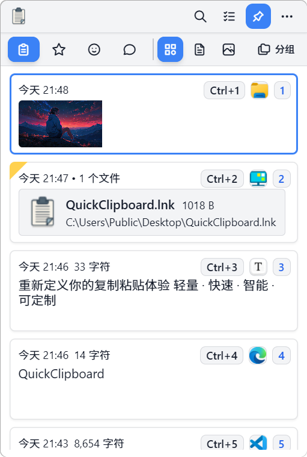
      </a>
      <div><strong>Light</strong></div>
    </td>
    <td>
      <a href="../readme-assets/display/浅色手绘.png" target="_blank">
        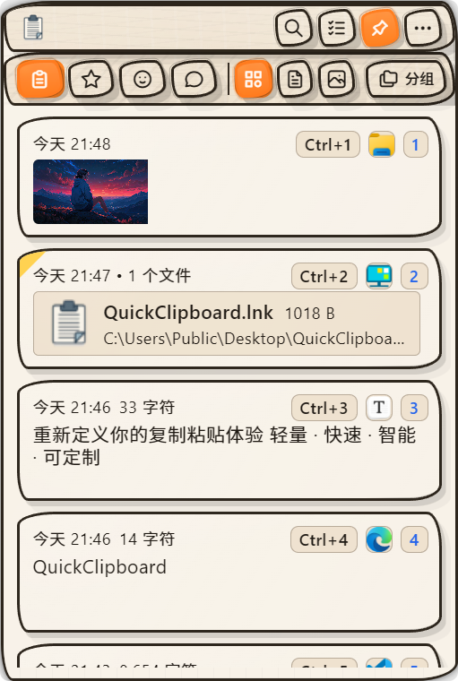
      </a>
      <div><strong>Light Sketch</strong></div>
    </td>
    <td>
      <a href="../readme-assets/display/暗色.png" target="_blank">
        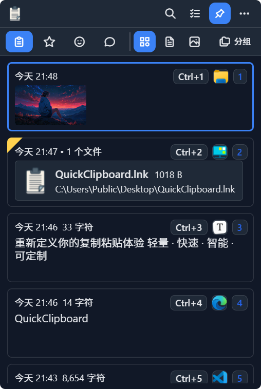
      </a>
      <div><strong>Dark</strong></div>
    </td>
    <td>
      <a href="../readme-assets/display/暗色经典.png" target="_blank">
        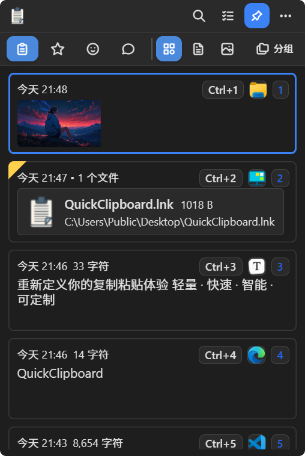
      </a>
      <div><strong>Dark Classic</strong></div>
    </td>
    <td>
      <a href="../readme-assets/display/暗色手绘.png" target="_blank">
        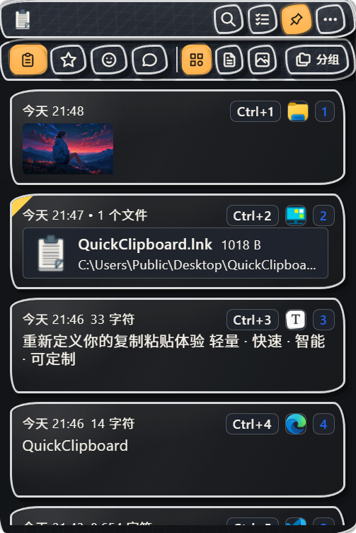
      </a>
      <div><strong>Dark Sketch</strong></div>
    </td>
    <td>
      <a href="../readme-assets/display/自定义背景.png" target="_blank">
        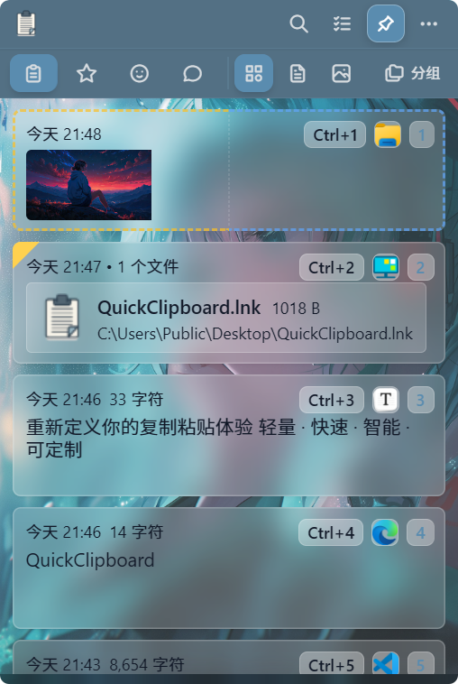
      </a>
      <div><strong>Custom Background</strong></div>
    </td>
  </tr>
</table>

<table>
  <tr align="center">
    <td>
      <a href="../readme-assets/display/设置.png" target="_blank">
        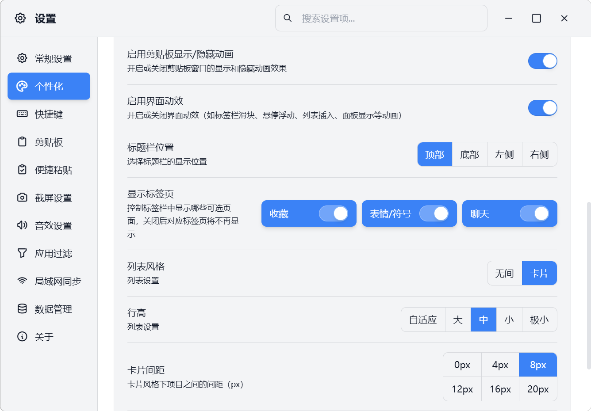
      </a>
      <div><strong>Settings</strong></div>
    </td>
    <td>
      <a href="../readme-assets/display/表情符号页.png" target="_blank">
        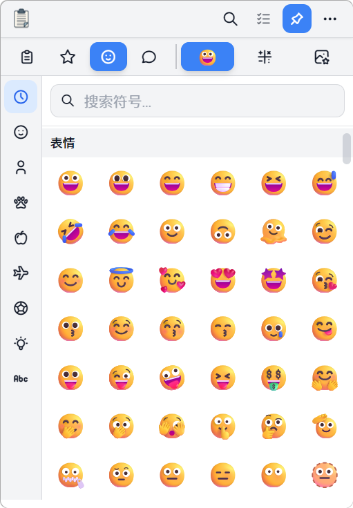
      </a>
      <div><strong>Emoji Picker</strong></div>
    </td>
    <td>
      <a href="../readme-assets/display/图库页.png" target="_blank">
        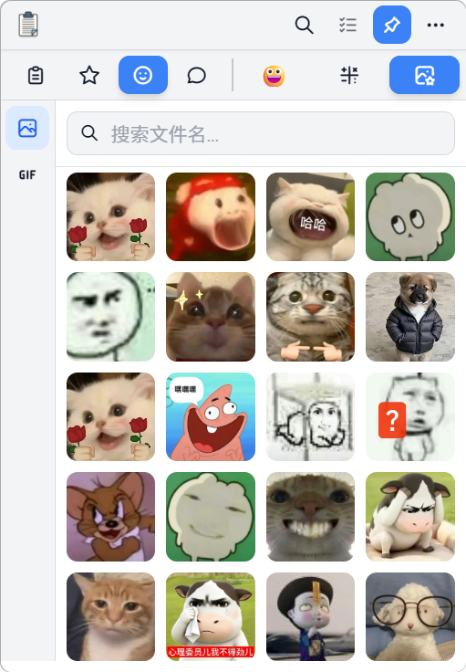
      </a>
      <div><strong>Gallery</strong></div>
    </td>
  </tr>
</table>

<table>
  <tr align="center">
    <td>
      <a href="../readme-assets/display/内容预览.gif" target="_blank">
        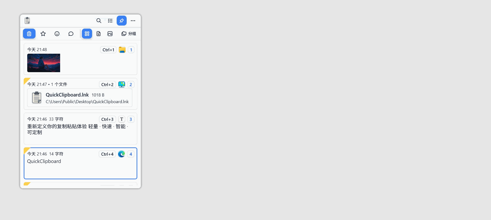
      </a>
      <div><strong>Content Preview</strong></div>
    </td>
  </tr>
</table>

</div>

---

## System Requirements

- Windows 10 / 11 (x64)

---

## Download (v0.4.0)

| Type                                                        |                   Description |                                                      Downloads                                                      | Link                                                                                                                                                                                          |
| ----------------------------------------------------------- | ----------------------------: | :-----------------------------------------------------------------------------------------------------------------: | --------------------------------------------------------------------------------------------------------------------------------------------------------------------------------------------- |
| **NSIS Installer**<br>`QuickClipboard_0.4.1_x64-setup.exe`  |    Recommended; supports auto-uninstall |  | [](https://github.com/mosheng1/QuickClipboard/releases/download/v0.4.1/QuickClipboard_0.4.1_x64-setup.exe) |
| **Portable (Standalone)**<br>`QuickClipboard_0.4.1.exe`      |     No installation required  |        | [](https://github.com/mosheng1/QuickClipboard/releases/download/v0.4.1/QuickClipboard_0.4.1.exe)    |
| **Portable (USB)**<br>`QuickClipboard_0.4.1_portable.exe`    | Ideal for USB drives & mobile use |  | [](https://github.com/mosheng1/QuickClipboard/releases/download/v0.4.1/QuickClipboard_0.4.1_portable.exe) |
| **Android APK**<br>`QuickClipboard_Android_v1.0.4.apk`       |        For Android devices    |  | [](https://github.com/mosheng1/QuickClipboard/releases/download/v0.4.0/QuickClipboard_Android_v1.0.4.apk) |
| **Cloud Drive**                                              | Alternative if GitHub is slow |                                                      —                                                              | [](https://www.123912.com/s/A9Ckjv-Vu75v?pwd=UhWA#)                                            |

---

## Website · Tutorials · Community

<div align="center">

<a href="https://space.bilibili.com/438982697" target="_blank">
  
</a>

<p style="margin-top:6px; margin-bottom:18px;">
  Features demos, usage tutorials, installation guides, and FAQs
</p>

<a href="https://quickclipboard.cn/" target="_blank">
  
</a>

<p style="margin-top:6px; margin-bottom:24px;">
  Get the latest version, download mirrors, documentation, and more
</p>

<p style="margin-top:10px; margin-bottom:12px;">
  Scan the QR code or search for the group number to join:
</p>

<table>
  <tr>
    <td align="center" width="33%">
      <a href="https://pd.qq.com/s/blp3j847c" target="_blank">
        
      </a>
      <div style="margin-top:8px;"><strong>Channel:</strong> pd80680380</div>
      <div style="margin-top:10px;">
        <a href="https://pd.qq.com/s/blp3j847c" target="_blank">
          
        </a>
      </div>
    </td>
    <td align="center" width="33%">
      <a href="https://qm.qq.com/q/nUCO76MX9C" target="_blank">
        
      </a>
      <div style="margin-top:8px;"><strong>Group 1:</strong> 725313287</div>
      <div style="margin-top:10px;">
        <a href="https://qm.qq.com/q/nUCO76MX9C" target="_blank">
          
        </a>
      </div>
    </td>
    <td align="center" width="33%">
      <a href="https://qm.qq.com/q/O5zOi3uTuy" target="_blank">
        
      </a>
      <div style="margin-top:8px;"><strong>Group 2:</strong> 1033556729</div>
      <div style="margin-top:10px;">
        <a href="https://qm.qq.com/q/O5zOi3uTuy" target="_blank">
          
        </a>
      </div>
    </td>
  </tr>
</table>

</div>

---

## Support & Sponsorship

<div align="center">
  <p>If you find this project helpful, feel free to Star, Fork, or support development via donations.</p>
  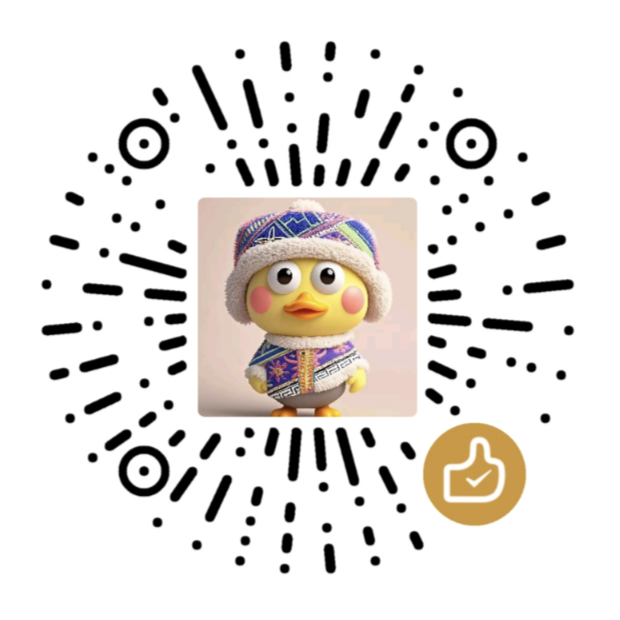
</div>


---

## Development & Build

### Prerequisites

- Node.js ≥ 16  
- Rust ≥ 1.70  
- Tauri CLI ≥ 2.0

### Common Commands

```bash
# Install dependencies
npm install

# Development mode
npm run tauri dev

# Build release
npm run tauri:build

# Community edition dev mode (without private plugins)
npm run tauri:dev:community

# Community edition build (without private plugins)
npm run tauri:build:community
```

### About Private Plugins

The **official release** of this project includes the following private plugins (not included in the open-source scope):

- `gpu-image-viewer` (GPU-accelerated image viewer): Enhances pin-to-screen and image preview performance, significantly reducing memory usage when multiple pinned image windows are open.
- `screenshot-suite` (Screenshot suite): Includes free-form screenshot, screenshot-to-pin, screenshot OCR, scrolling screenshot, and related capabilities.

---

## License

This project is licensed under the [Apache License 2.0](LICENSE).

> Private plugins `gpu-image-viewer` and `screenshot-suite` are not included in the open-source scope and are only available in the official release.
